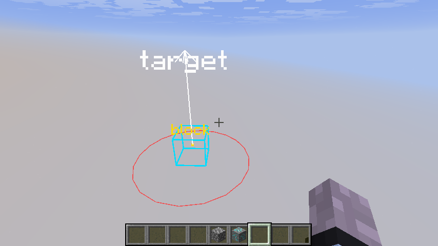
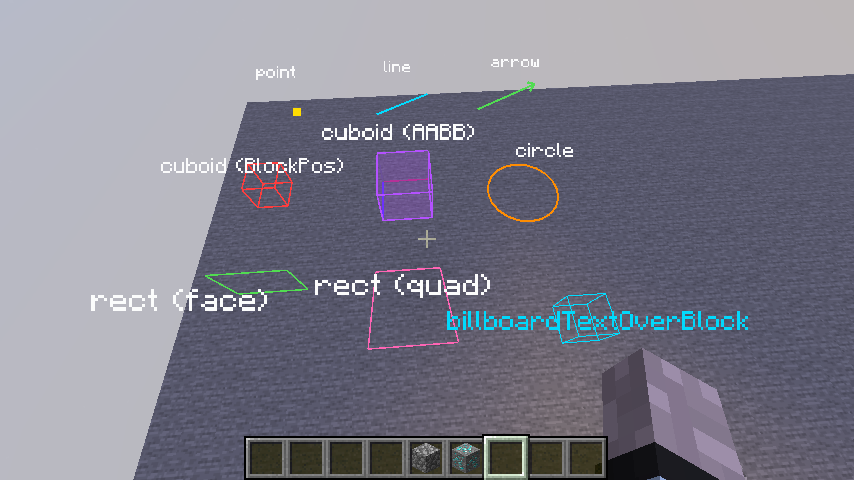

# Rendering in Minecraft 1.21.11 with Pyjinn using Gizmos
###### (by [RazrCraft](https://github.com/R4z0rX))
<br>

A complete guide to the `Gizmos` API for overlay rendering in Pyjinn scripts.
Gizmos is a new rendering system in Minecraft that replaces the old 
`DebugRenderer` / `ShapeRenderer` / `MultiBufferSource` approach and is by far 
the simplest way to draw debug geometry and text in world space.

---

## Why Gizmos?

In 1.21.11 the manual rendering pipeline requires a `BufferBuilder`, a
`MappableRingBuffer`, a full GPU render pass, and reflection hacks to disable the
depth test. Gizmos collapses all of that into a single static method call.

| Feature | Old pipeline | Gizmos |
|---|---|---|
| Lines / boxes | ~80 lines of boilerplate | `Gizmos.line(...)`<br>`Gizmos.cuboid(...)` |
| See-through | Reflection on `depthTestFunction` | `.setAlwaysOnTop()` |
| Floating text | `DebugRenderer` (removed in 1.21.11) | `Gizmos.billboardText(...)` |
| Persistent overlay | Re-submit every frame manually | `.persistForMillis(ms)` |

**Rule of thumb:** use Gizmos for everything visual unless you need a custom vertex
format or extremely high vertex counts.

---

## Setup

```python
# The Minescript standard library is imported implicitly, but for simple IDE 
# integration (e.g. VSCode) you can import `minescript` module explicitly.
from minescript import add_event_listener, remove_event_listener

# Required Java classes
Gizmos          = JavaClass("net.minecraft.gizmos.Gizmos")
GizmoStyle      = JavaClass("net.minecraft.gizmos.GizmoStyle")
TextGizmo_Style = JavaClass("net.minecraft.gizmos.TextGizmo$Style")
BlockPos        = JavaClass("net.minecraft.core.BlockPos")
Vec3            = JavaClass("net.minecraft.world.phys.Vec3")
AABB            = JavaClass("net.minecraft.world.phys.AABB")
Direction       = JavaClass("net.minecraft.core.Direction")
ARGB            = JavaClass("net.minecraft.util.ARGB")
```

All `Gizmos.*` factory calls must happen inside a `"render"` event callback.
Each call submits the gizmo for the current frame — nothing persists by default.

```python
def on_render(event) -> None:
    # call Gizmos.* here

listener = add_event_listener("render", on_render)
# later: remove_event_listener(listener)
```

---

## Colors

All color parameters are packed ARGB integers. Use `ARGB.color(alpha, red, green, blue)`:

```python
red          = ARGB.color(255, 255,   0,   0)   # opaque red
semi_green   = ARGB.color(128,   0, 255,   0)   # 50% transparent green
white        = ARGB.color(255, 255, 255, 255)
```

> **Note:** the argument order is **alpha first**, then R, G, B.

---

## GizmoProperties — modifiers on every gizmo

Every `Gizmos.*` factory returns a `GizmoProperties` object. All methods return
`self`, so they are chainable.

```python
gizmo = Gizmos.line(start, end, color)

gizmo.setAlwaysOnTop()          # render through blocks (no depth test)
gizmo.persistForMillis(500)     # stay visible for 500 ms without re-submitting
gizmo.fadeOut()                 # fade out during its lifespan

# Chainable:
Gizmos.point(pos, color, JavaFloat(4.0)).setAlwaysOnTop().persistForMillis(200).fadeOut()
```

Without `.setAlwaysOnTop()`, geometry respects the depth buffer and is hidden by
solid blocks — exactly like a normal rendered object.

---

## GizmoStyle — stroke and fill for shapes

Used by `cuboid`, `circle`, `rect`, and `arrow`.

```python
stroke_color = ARGB.color(255, 255, 128,   0)   # orange
fill_color   = ARGB.color(80,  255, 128,   0)   # orange, 30% alpha

# Outline only (default line width)
GizmoStyle.stroke(stroke_color)

# Outline with custom line width (float)
GizmoStyle.stroke(stroke_color, JavaFloat(3.0))

# Filled with color (int), no outline
GizmoStyle.fill(fill_color)

# Both outline and fill
GizmoStyle.strokeAndFill(stroke_color, JavaFloat(2.0), fill_color)
```

---

## TextGizmo$Style — style for billboard text

```python
color = ARGB.color(255, 255, 255,   0)   # yellow

# White, centered (no color argument)
TextGizmo_Style.whiteAndCentered()

# Custom color (int), centered
TextGizmo_Style.forColorAndCentered(color)

# Custom color (int), left-aligned
TextGizmo_Style.forColor(color)

# Change the scale (float)
TextGizmo_Style.withScale(scale)

# Modifiers (chainable):
style = TextGizmo_Style.forColorAndCentered(color).withScale(JavaFloat(2.0))
style = TextGizmo_Style.forColor(color).withLeftAlignment(JavaFloat(0.5))
```

---

## All Gizmos

### Point

Renders a colored dot at a world position.

```python
# Gizmos.point(Vec3 pos, int color, float size)
pos   = Vec3(JavaFloat(10.5), JavaFloat(65.0), JavaFloat(10.5))
color = ARGB.color(255, 255, 0, 0)

Gizmos.point(pos, color, JavaFloat(5.0)).setAlwaysOnTop()
```

---

### Line

Renders a straight line between two world positions.

```python
# Gizmos.line(Vec3 start, Vec3 end, int color)
# Gizmos.line(Vec3 start, Vec3 end, int color, float width)
start = Vec3(JavaFloat(0.0), JavaFloat(64.0), JavaFloat(0.0))
end   = Vec3(JavaFloat(10.0), JavaFloat(70.0), JavaFloat(5.0))
color = ARGB.color(255, 0, 255, 255)

Gizmos.line(start, end, color).setAlwaysOnTop()
Gizmos.line(start, end, color, JavaFloat(3.0)).setAlwaysOnTop()  # thicker
```

---

### Arrow

Like a line but with an arrowhead at the end. Useful for indicating direction or velocity.

```python
# Gizmos.arrow(Vec3 start, Vec3 end, int color)
# Gizmos.arrow(Vec3 start, Vec3 end, int color, float width)
origin = Vec3(JavaFloat(0.0), JavaFloat(65.0), JavaFloat(0.0))
target = Vec3(JavaFloat(5.0), JavaFloat(65.0), JavaFloat(0.0))
color  = ARGB.color(255, 255, 200, 0)

Gizmos.arrow(origin, target, color).setAlwaysOnTop()
Gizmos.arrow(origin, target, color, JavaFloat(2.5)).setAlwaysOnTop()
```

---

### Cuboid (box outline)

Renders a wireframe or filled box. Three overloads:

```python
color       = ARGB.color(255, 0, 200, 255)
fill_color  = ARGB.color(60,  0, 200, 255)
style       = GizmoStyle.stroke(color)
filled      = GizmoStyle.strokeAndFill(color, JavaFloat(1.5), fill_color)

# From a BlockPos — outlines the full 1×1×1 block
Gizmos.cuboid(BlockPos(10, 64, 10), style).setAlwaysOnTop()

# From a BlockPos with expansion (positive = larger box, negative = inset)
Gizmos.cuboid(BlockPos(10, 64, 10), JavaFloat(0.1), style).setAlwaysOnTop()

# From an AABB (arbitrary axis-aligned box)
box = AABB(JavaFloat(9.5), JavaFloat(63.5), JavaFloat(9.5),
           JavaFloat(11.5), JavaFloat(65.5), JavaFloat(11.5))
Gizmos.cuboid(box, style).setAlwaysOnTop()

# With colored corner strokes (highlights the 8 corners differently)
Gizmos.cuboid(box, filled, True).setAlwaysOnTop()
```

---

### Circle

Renders a circle (ring) in the horizontal plane at a world position.

```python
# Gizmos.circle(Vec3 pos, float radius, GizmoStyle style)
center = Vec3(JavaFloat(10.5), JavaFloat(65.0), JavaFloat(10.5))
color  = ARGB.color(255, 128, 0, 255)
style  = GizmoStyle.stroke(color, JavaFloat(2.0))

Gizmos.circle(center, JavaFloat(5.0), style).setAlwaysOnTop()
```

---

### Rect (rectangle / quad)

Two overloads: an axis-aligned face on a block face, or a fully custom 4-point quad.

```python
color = ARGB.color(200, 255, 128, 0)
style = GizmoStyle.fill(color)

# Axis-aligned face: north-west-down corner, south-east-up corner, and a Direction
nwd = Vec3(JavaFloat(10.0), JavaFloat(64.0), JavaFloat(10.0))
seu = Vec3(JavaFloat(11.0), JavaFloat(65.0), JavaFloat(11.0))
Gizmos.rect(nwd, seu, Direction.UP, style).setAlwaysOnTop()

# Arbitrary quad: 4 corners in order
a = Vec3(JavaFloat(10.0), JavaFloat(65.0), JavaFloat(10.0))
b = Vec3(JavaFloat(12.0), JavaFloat(65.0), JavaFloat(10.0))
c = Vec3(JavaFloat(12.0), JavaFloat(65.0), JavaFloat(12.0))
d = Vec3(JavaFloat(10.0), JavaFloat(65.0), JavaFloat(12.0))
Gizmos.rect(a, b, c, d, style).setAlwaysOnTop()
```

Available `Direction` values: `Direction.UP`, `Direction.DOWN`, `Direction.NORTH`,
`Direction.SOUTH`, `Direction.EAST`, `Direction.WEST`.

---

### Billboard Text

Floating text that always faces the camera (billboard).

```python
# Gizmos.billboardText(String text, Vec3 pos, TextGizmo$Style style)
pos   = Vec3(JavaFloat(10.5), JavaFloat(67.0), JavaFloat(10.5))
color = ARGB.color(255, 255, 255, 0)
style = TextGizmo_Style.forColorAndCentered(color).withScale(JavaFloat(1.5))

Gizmos.billboardText("Hello world", pos, style).setAlwaysOnTop()
```

---

### Billboard Text Over Block

Convenience wrapper that places billboard text above a block, with a vertical offset.

```python
# Gizmos.billboardTextOverBlock(String text, BlockPos blockPos,
#                                int yOffset, int color, float scale)
color = ARGB.color(255, 200, 200, 255)

Gizmos.billboardTextOverBlock("spawner", BlockPos(10, 64, 10),
                               0, color, JavaFloat(1.0)).setAlwaysOnTop()

# yOffset shifts the text up/down in pixels relative to the top of the block.
# Negative moves it down, positive moves it up.
Gizmos.billboardTextOverBlock("label", BlockPos(10, 64, 10),
                               -2, color, JavaFloat(0.8)).setAlwaysOnTop()
```

---

### Billboard Text Over Mob

Places billboard text above an entity. Requires a Java `Entity` reference.

```python
# Gizmos.billboardTextOverMob(Entity entity, int yOffset, String text,
#                              int color, float scale)
# (entity must be a Java Entity object obtained from the Minecraft API)
color = ARGB.color(255, 255, 100, 100)

Gizmos.billboardTextOverMob(entity, 0, "target", color, JavaFloat(1.0)).setAlwaysOnTop()
```

---

## Complete example

```python
from minescript import add_event_listener, remove_event_listener, set_timeout

Gizmos          = JavaClass("net.minecraft.gizmos.Gizmos")
GizmoStyle      = JavaClass("net.minecraft.gizmos.GizmoStyle")
TextGizmo_Style = JavaClass("net.minecraft.gizmos.TextGizmo$Style")
BlockPos        = JavaClass("net.minecraft.core.BlockPos")
Vec3            = JavaClass("net.minecraft.world.phys.Vec3")
AABB            = JavaClass("net.minecraft.world.phys.AABB")
Direction       = JavaClass("net.minecraft.core.Direction")
ARGB            = JavaClass("net.minecraft.util.ARGB")

TARGET = BlockPos(10, 64, 10)
cx, cy, cz = 10.5, 64.5, 10.5   # center of TARGET block

def on_render(event) -> None:
    white  = ARGB.color(255, 255, 255, 255)
    cyan   = ARGB.color(255,   0, 220, 255)
    yellow = ARGB.color(255, 255, 220,   0)
    red    = ARGB.color(200, 255,  50,  50)

    center = Vec3(JavaFloat(cx), JavaFloat(cy), JavaFloat(cz))
    above  = Vec3(JavaFloat(cx), JavaFloat(cy + 3.0), JavaFloat(cz))

    # Wireframe box around the target block
    Gizmos.cuboid(TARGET, GizmoStyle.stroke(cyan)).setAlwaysOnTop()

    # Point at block center
    Gizmos.point(center, yellow, JavaFloat(5.0)).setAlwaysOnTop()

    # Arrow pointing up from center
    Gizmos.arrow(center, above, white, JavaFloat(2.0)).setAlwaysOnTop()

    # Circle around the block at ground level
    ground = Vec3(JavaFloat(cx), JavaFloat(64.0), JavaFloat(cz))
    Gizmos.circle(ground, JavaFloat(2.0),
                  GizmoStyle.stroke(red, JavaFloat(1.5))).setAlwaysOnTop()

    # Floating label
    style = TextGizmo_Style.forColorAndCentered(white).withScale(JavaFloat(1.2))
    Gizmos.billboardText("target", above, style).setAlwaysOnTop()

    # Label pinned above the block
    Gizmos.billboardTextOverBlock("block", TARGET, 0,
                                  yellow, JavaFloat(0.8)).setAlwaysOnTop()

listener = add_event_listener("render", on_render)
set_timeout(lambda: remove_event_listener(listener), 30_000)
```

  
Result of this example.
  
  
Demonstration of the [`gizmos_showcase.pyj`](gizmos_showcase.pyj) script that accompanies this guide.

---

## Common mistakes

**Missing `JavaFloat` on float parameters.** Size, width, radius, scale, and
expansion all take Java `float`. Without `JavaFloat(...)` Pyjinn passes a Java
`double`, which picks the wrong overload or crashes.

```python
# Correct
Gizmos.point(pos, color, JavaFloat(4.0))

# Wrong — passes double, may crash or pick wrong overload
Gizmos.point(pos, color, 4.0)
```

**Forgetting `.setAlwaysOnTop()`.** Without it, geometry is depth-tested and
hidden by solid blocks.

**Calling Gizmos outside the render callback.** Gizmo calls must happen inside
a `"render"` event handler. Calling them from a tick or from top-level script code
will silently do nothing or crash.
